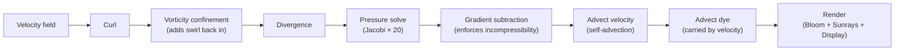
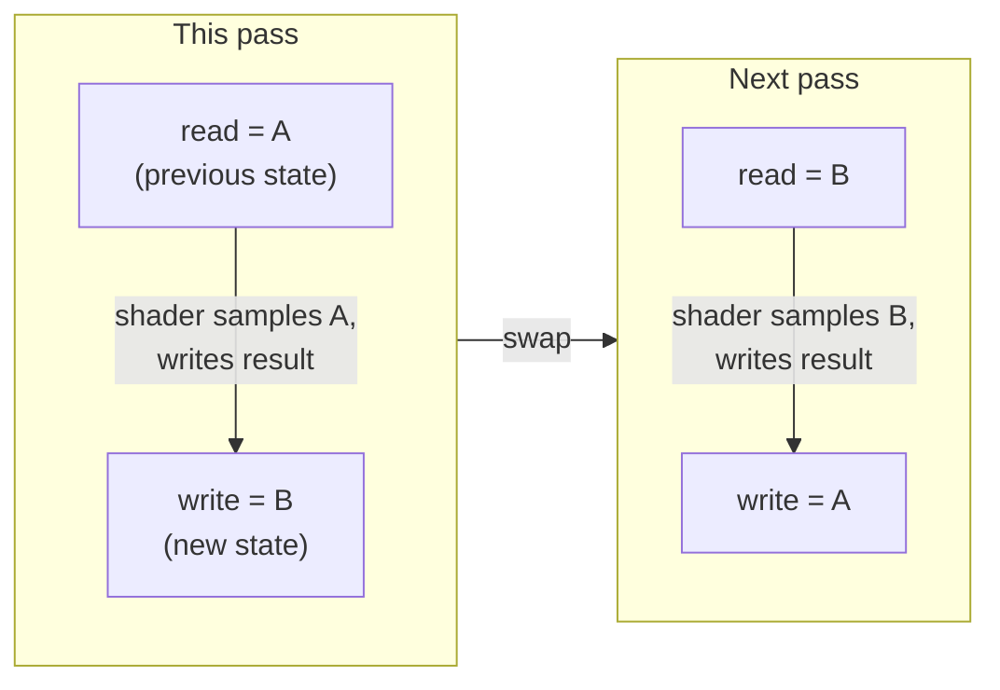
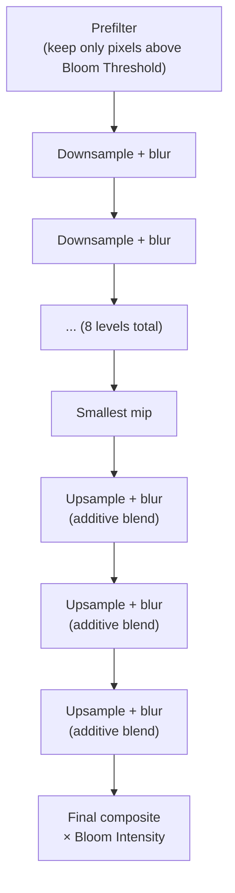

# Fluid Simulation

| Play screen | Settings screen |
|:---:|:---:|
|  |  |

Built on **[slaviboy/OpenGL](https://github.com/slaviboy/OpenGL)** — an Android OpenGL ES utility library — for its low-level GLES helper functions, with the entire GPU simulation pipeline itself hand-written in raw OpenGL ES 3.0/GLSL (see [Libraries used](#libraries-used) for exactly what comes from where).

A native Android/Kotlin fluid simulation rendered with OpenGL ES 3.0 and driven by touch. It runs a real-time incompressible fluid solver entirely on the GPU as a full-screen app, with a native settings UI on top for tuning the simulation live.

## What it does

Drag a finger across the screen and it injects a splat of colored dye plus a velocity impulse into the fluid field. The GPU then solves the Navier–Stokes equations for an incompressible fluid every frame (curl → vorticity confinement → divergence → pressure solve → advection), producing the swirling, smoke-like color trails. An initial burst of random splats plays on launch so the screen is never empty.

## How it works

### The physics: why this looks like a real fluid

A real fluid (smoke, ink in water, cream in coffee) obeys the **Navier–Stokes equations** for incompressible flow. Informally, two rules govern everything:

1. **Momentum carries itself forward.** Whatever the fluid is doing right now (its velocity field) determines where it — and anything floating in it, like dye — moves to next. This is called **advection**.
2. **Fluid can't be created, destroyed, or compressed.** If flow is converging into a point, pressure must push back out to keep the total volume constant. This is the **incompressibility constraint**, enforced through a **pressure field**.

Solving these equations exactly is expensive and numerically fragile (naive solvers blow up or turn to NaN at real-time timesteps). This project uses **Jos Stam's "Stable Fluids"** method instead — the same technique behind most real-time fluid effects in games and demos — which reformulates the problem as a short pipeline of GPU-friendly steps that stay stable regardless of frame rate. Every step is a full-screen GLSL fragment shader that reads one or more textures and writes a new one; there's no CPU-side physics at all.

### The data: fluid state as textures

The simulation has no particles or vertices — just a handful of 2D textures, each one a grid where every texel is a physical quantity at that point in space:

| Field | Texture format | What each texel stores |
|---|---|---|
| **Velocity** | 2-channel (RG16F) | The flow's (x, y) direction and speed at that point |
| **Dye** | 4-channel (RGBA16F) | The visible color being carried along by the flow |
| **Pressure** | 1-channel (R16F) | The pressure needed to keep flow divergence-free |
| **Divergence** | 1-channel (R16F) | How much the velocity field currently violates incompressibility |
| **Curl** | 1-channel (R16F) | The local rotation ("spin") of the flow, used for the swirl effect below |

Velocity/pressure/divergence/curl all share one low resolution (**Sim Resolution** in settings — this is the actual physics grid), while dye is kept at a separate, much higher resolution (**Dye Resolution**) since color detail is far more visually important than physics precision — this is the single biggest performance/quality knob in the whole simulation.

### The per-frame pipeline



1. **Curl** — measures how much the velocity field is rotating at each point (`∂vy/∂x − ∂vx/∂y`), written into a scratch texture.
2. **Vorticity confinement** — turns curl back into a force and adds it to velocity. Advection alone numerically "smears out" fine rotational detail every frame; this step actively re-injects it, which is what gives the fluid its characteristic tight little swirls and eddies instead of just smoothly blurring into mush. The **Vorticity** setting scales how strong this force is.
3. **Divergence** — measures how much the current velocity field is "pooling" or "spreading" at each point — the amount by which it violates "fluid can't be created or destroyed."
4. **Pressure solve** — finds the pressure field that would exactly cancel that divergence out, by relaxing a Poisson equation with a **Jacobi iteration**: a simple GPU-friendly loop where every pixel repeatedly averages with its neighbors, minus the local divergence, converging closer to the correct answer each pass (20 passes by default — more passes look "stiffer" and more physically accurate at the cost of GPU time).
5. **Gradient subtraction** — subtracts the pressure field's gradient from velocity. This is the step that actually *enforces* incompressibility: afterward, the velocity field is (very nearly) divergence-free.
6. **Advect velocity, then dye** — for every texel, trace backward along the (now-correct) velocity field to find "where did the fluid here come from a moment ago," then sample that source position. Velocity advects *itself* this way (it carries its own momentum forward); dye is advected by that same velocity field, which is why the color always follows the flow exactly.
7. **Render** — composites the dye field to the screen, with two optional GPU post-effects layered on: **Bloom** and **Sunrays** (below), plus a cheap fake-3D shading pass computed from the dye field's own brightness gradient.

Every step above is one of 20 GLSL ES 3.0 fragment shaders in `app/src/main/res/raw/`, run in `FluidRenderer.kt`. Nothing here is a special case for touch or for any particular effect — the exact same handful of shaders run every single frame regardless of whether anything is currently touching the screen.

### Reading and writing at the same time: double buffering

Nearly every step above needs to read a field's *current* value at many neighboring texels while computing its *new* value — writing in place would corrupt those reads mid-pass, since a GPU has no guaranteed order for which pixel finishes first. Velocity, dye, and pressure are therefore all **double-buffered** (`DoubleFbo.kt`): two textures, `read` and `write`. A pass always reads from `read` and writes to `write`; once it finishes, the two are swapped, so `write` becomes next frame's `read`.



### Turning bright pixels into a glow: Bloom

Bloom makes the brightest parts of the fluid look like they're radiating light, using a **mip-chain blur** — the same technique real-time renderers use for glow effects generally:



The **prefilter** pass keeps only pixels brighter than **Bloom Threshold** (with a soft "knee" so the cutoff isn't a harsh line). That result is then repeatedly downsampled and blurred into progressively smaller textures — each level blurring at a different physical radius relative to the screen — then blurred again on the way back *up* the chain with additive blending, so every scale of glow gets layered back together into one soft halo. **Bloom Intensity** scales the final result before it's added to the display.

### Light shafts radiating outward: Sunrays

Sunrays extracts a brightness mask from the dye field, then for every pixel walks a fixed number of steps *toward the screen center*, accumulating how much bright "stuff" it passes through along the way (decaying with distance) — the classic "radial god-rays" accumulation technique. Brighter, more continuous streaks toward the center accumulate a stronger ray. **Sunrays Weight** scales how strongly this contributes to the final image.

### Why there's a dithering texture

Bloom's final composite includes a gamma-correction step, which can introduce visible color banding in smooth gradients (an 8-bit-per-channel screen just doesn't have enough distinct brightness steps to render a perfectly smooth gradient). A small tileable noise texture (`ldr_lll1_0.png`) is sampled alongside the bloom and used to jitter each pixel by a tiny random amount before it's displayed — imperceptible on its own, but enough to break up banding into indistinguishable-from-smooth noise instead.

### From a touch to a force: splats

Dragging a finger doesn't touch the simulation state directly — every frame, each moved touch calls into the **splat** shader twice: once to add a velocity impulse (based on how far and fast the finger moved) into the velocity field, and once to add a burst of color into the dye field, both centered on the touch position with a smooth Gaussian falloff (`exp(-distance² / radius)`) so a splat fades out softly at its edges instead of having a hard boundary. The **Splat Radius** setting scales that falloff distance. An aspect-ratio correction keeps splats circular (not stretched into ovals) on non-square screens.

### Package layout

```
app/src/main/java/com/slaviboy/fluidsimulation/
├── MainActivity.kt                 # Compose entry point, settings gear icon, dialogs
├── fluid/
│   ├── FluidConfig.kt               # every tunable parameter + defaults + reset()
│   ├── ColorUtil.kt                 # HSV↔RGB, random dye color generation
│   ├── FluidRenderer.kt             # GLSurfaceView.Renderer — the whole pipeline above
│   ├── FluidSurfaceView.kt          # GLSurfaceView subclass, EGL/touch setup
│   ├── gl/
│   │   ├── ShaderProgram.kt         # compiles/links a shader, introspects uniforms
│   │   ├── DisplayMaterial.kt       # compiles a shader variant per SHADING/BLOOM/SUNRAYS combo
│   │   ├── Fbo.kt / DoubleFbo.kt    # framebuffer object wrappers
│   │   ├── Blit.kt                  # shared full-screen quad every pass draws with
│   │   ├── TextureFormatProbe.kt    # picks the best float texture format the GPU supports
│   │   └── ShaderText.kt            # loads a .glsl resource, injects #version/#define
│   └── input/
│       ├── Pointer.kt               # one active touch's tracked state
│       └── PointerManager.kt        # MotionEvent → normalized splat coordinates
├── ui/
│   ├── settings/FluidSettingsScreen.kt   # the settings screen (see below)
│   └── theme/                       # standard Compose Material3 theme files
└── (res/raw/*.glsl)                 # the 20 shaders described above
```

### Libraries used

| Library | What it's used for |
|---|---|
| **Jetpack Compose** (`androidx.compose.*`, Material3) | The entire UI layer — the settings screen, the gear icon, dialogs, theming. The simulation itself is plain OpenGL ES, not Compose. |
| **[`com.github.slaviboy:OpenGL`](https://github.com/slaviboy/OpenGL)** (via JitPack) | A small 2D-shapes/gesture Android OpenGL ES toolkit by the same author as this project. It has **no framebuffer or multi-pass shader support**, so it can't host the simulation pipeline itself — it's used only for two small GLES helper functions (`OpenGLStatic.checkGlError`, `OpenGLStatic.readTextFileFromResource`) reused inside `ShaderProgram`/`ShaderText`. Everything else (the FBOs, the 20 shaders, the whole pipeline) is hand-written raw `android.opengl.GLES30` code, following the same `GLSurfaceView` + `Renderer` architecture pattern the library's own example app and the author's [Galaxy](https://github.com/slaviboy/Galaxy) app use. |
| `androidx.core:core-ktx`, `androidx.lifecycle:lifecycle-runtime-ktx`, `androidx.activity:activity-compose` | Standard AndroidX/Compose scaffolding (edge-to-edge, lifecycle observers, `ComponentActivity`). |

No dependency provides GPGPU/multi-pass rendering — that part is 100% custom, since nothing off-the-shelf covers it for Android.

### A few Android-specific quirks worth knowing about

- **`GLSurfaceView` needs `setZOrderOnTop(true)`.** Hosting a `GLSurfaceView` inside Compose's `AndroidView` doesn't reliably let its content show through (the usual "hole punch" a `SurfaceView` relies on doesn't work well there) — without this flag the whole screen renders solid black despite the simulation running correctly underneath.
- That flag has a side effect: it also hides *any* normal Compose content stacked on top of it in the same window (the gear icon, the settings screen). Both are hosted in their own `Dialog` windows instead, since a separate Android window always composites above regardless of that flag.
- **`GLSurfaceView.onPause()`/`onResume()`** are wired manually to the Activity's lifecycle in `MainActivity.kt` — Compose's `AndroidView` doesn't forward these automatically, and without them the screen stays black forever after backgrounding the app once.
- The settings screen uses `DialogProperties(decorFitsSystemWindows = false)` so it's genuinely edge-to-edge (covers the status bar / gesture nav area) rather than looking like a floating card.
- `onSurfaceCreated` treats every call as a full reset (recompiles all shaders, discards all framebuffers) since Android can silently destroy and recreate the GL context, e.g. when backgrounding the app.

## The settings screen

Tap the gear icon (top-right) to open a full-screen settings panel, bound live to the running simulation:

### Simulation
| Setting | What it controls |
|---|---|
| **Sim Resolution** | Grid resolution (32/64/128/256) of the velocity/pressure/divergence/curl fields — the physics. Lower = faster/blurrier flow, higher = crisper/slower. |
| **Dye Resolution** | Grid resolution (128/256/512/1024) of the color field — this is what determines how sharp the colors themselves look, independent of the physics resolution. |
| **Density Diffusion** | How fast dye color fades away over time. |
| **Velocity Diffusion** | How fast the flow itself slows down/settles. |
| **Pressure** | Damping applied to the pressure field each frame — affects how "stiff" vs. "loose" the incompressibility feels. |
| **Vorticity** | Strength of the vorticity-confinement swirl effect — higher values add more fine-grained turbulent detail. |
| **Splat Radius** | How large an area each touch splat covers. |

### Rendering
| Setting | What it controls |
|---|---|
| **Shading** | A cheap fake-3D lighting effect derived from the dye field's local gradient, giving the fluid visible depth/highlights. |
| **Colorful** | Whether each active touch's dye color keeps cycling automatically over time. |
| **Paused** | Freezes the physics step (splats and rendering still work; the fluid just stops evolving). |
| **Bloom** (+ Intensity, Threshold) | A glow effect around the brightest parts of the fluid — Threshold picks how bright a pixel must be before it blooms, Intensity scales how strong the glow is. |
| **Sunrays** (+ Weight) | Radial light-shaft streaks accumulated outward from bright areas toward the screen center. |

### Background
| Setting | What it controls |
|---|---|
| **Transparent** | Whether the background is a checkerboard (useful for judging alpha) instead of a flat fill color. |
| **Background Color** | A full HSV picker (Hue / Saturation / Brightness sliders) for the fill color used when not transparent. |

### Actions
- **Random Splats** — fires an extra burst of randomly placed, randomly colored splats (the same effect that plays automatically once on launch).
- **Reset to Defaults** — restores every setting above back to its original value in one tap.

Toggling **Shading/Bloom/Sunrays** or changing either **Resolution** triggers actual GPU work (recompiling a shader variant or recreating framebuffers), which the renderer defers to the start of the next frame since that work must happen on the GL thread, not the UI thread the settings screen runs on. Every other slider/switch applies immediately.

## Design notes

- No screenshot/recording-to-file feature — out of scope for now.
- The advection shader always uses hardware bilinear filtering, which GLES 3.0 guarantees is available for the float texture formats this simulation uses.
- Touch handling is keyed directly by Android's own stable per-finger pointer IDs, so multiple simultaneous touches each get an independent splat trail.
